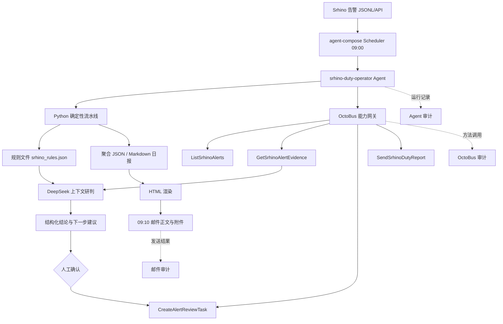

# Srhino 安全告警聚合分析与值守日报 Agent

这是一个面向安全运营值守场景的 Agent 项目。它将 Srhino 安全设备告警转化为可审计、可交付的值守日报，并对值守人员主动点击 AI 研判的少量重点告警提供原始 HTTP 证据分析和下一步处置建议。

> 重要说明：仓库中的告警、请求、回包、IP、域名和研判标签均为脱敏合成演示数据，不是深圳市信息安全管理中心的生产数据。真实项目接入时，应通过适配器映射到本文约定的标准字段，并在进入模型前执行脱敏。

## 目录

- [一、业务场景与预期价值](#一业务场景与预期价值)
- [二、项目内容](#二项目内容)
- [三、总体架构与职责边界](#三总体架构与职责边界)
- [四、端到端工作流程](#四端到端工作流程)
- [五、仓库结构](#五仓库结构)
- [六、数据模型与统计口径](#六数据模型与统计口径)
- [七、领域知识与可执行规则](#七领域知识与可执行规则)
- [八、Agent 与大模型分工](#八agent-与大模型分工)
- [九、OctoBus 服务包与能力链路](#九octobus-服务包与能力链路)
- [十、部署说明](#十部署说明)
- [十一、运行、查看和验收](#十一运行查看和验收)
- [十二、输出物与日报说明](#十二输出物与日报说明)
- [十三、实施问题与处理方式](#十三实施问题与处理方式)
- [十四、安全设计](#十四安全设计)
- [十五、发布前自检](#十五发布前自检)
- [十六、当前状态与后续工作](#十六当前状态与后续工作)

---

## 一、业务场景与预期价值

### 1.1 背景

我是石犀售前，前段时间参与深圳市信息安全管理中心的石犀平台测试，期间恰逢粤盾护网。石犀作为值守支撑方，每天需要根据安全设备告警提交值守日报。人工流程通常包括：

1. 从石犀平台或安全设备导出前一日告警；
2. 按风险等级、攻击类型、资产和时间段做统计；
3. 区分设备动作和运营处置结果；
4. 对值守人员主动点击 AI 研判的重点事件读取原始请求和回包；
5. 判断真实攻击、疑似误报或无法确认，并给出处置建议；
6. 跟踪风险预警、责任单位和闭环状态；
7. 编写、排版并发送值守日报。

这些工作重复性高，容易出现统计口径不一致、复制遗漏、结论没有证据和交接困难等问题。

### 1.2 Agent 解决的问题

本项目把“告警发现—确定性聚合—规则预判—AI 研判—人工确认—日报交付—审计留痕”串成一个可定时执行的闭环：

- 自动选择前一日数据并过滤日期；
- 准确统计高中低风险、风险类型、设备动作、重点资产、小时趋势和闭环率；
- 只把人工点击且具有完整请求/回包的重点事件交给 AI，控制成本和数据暴露范围；
- 先执行可审计的安全运营规则，再让模型理解请求、回包和业务上下文；
- 输出证据、置信度、下一步建议和人工动作，不让模型直接修改生产策略；
- 生成 Markdown 原文、自包含 HTML 和 HTML 邮件附件；
- 通过 OctoBus 调用能力并保留调用审计。

### 1.3 预期价值

| 价值 | 体现 |
| --- | --- |
| 效率 | 减少人工计数、复制、排版和邮件发送工作 |
| 质量 | 统一统计口径，结论绑定请求、回包、动作和规则依据 |
| 可追溯 | 保留聚合 JSON、日报原文、原始证据、Agent 运行记录和 OctoBus 审计 |
| 产品价值 | 将石犀的设备告警能力转化为值守日报、风险预警和闭环运营成果 |
| 安全边界 | 模型只给研判和建议，人工确认后才允许采取生产处置 |

### 1.4 非目标

当前版本不是生产封禁系统，也不自动修改 Srhino 规则、IP 黑名单或业务配置；`CreateAlertReviewTask` 是演示型人工复核能力，生产环境需要替换为真实 ITSM/工单系统适配器。

---

## 二、项目内容

仓库包含运行所需的 Agent 配置、脚本、规则、OctoBus 服务包和一组可复现的演示数据：

- `agent-compose.yml`：Agent、模型、能力集和 Scheduler 配置；
- `tools/`：数据生成、聚合、规则执行、日报渲染、邮件和测试脚本；
- `knowledge/`：人可读的运营规则和机器可执行的规则参数；
- `octobus-service/`：完整的 Srhino service package、Proto、配置 schema 和入口代码；
- `data/`、`reports/`：脱敏合成输入和示例输出；
- `srhino-duty-email.cron`：服务器 09:10 邮件任务模板。

服务器登录信息和公钥配置要求见文末。密码、模型 Key、SMTP 授权码和 OctoBus token 不放入仓库。

---

## 三、总体架构与职责边界



### 3.1 组件职责

| 组件 | 负责什么 | 不负责什么 |
| --- | --- | --- |
| Srhino 数据 | 提供告警、处置字段和人工研判证据 | 不负责日报排版和模型判断 |
| agent-compose | Agent 工作区、模型配置、工具编排、Scheduler、运行记录 | 不负责精确统计和后端权限治理 |
| Python 工具 | 日期选择、过滤、计数、闭环率、规则执行、日报渲染、邮件发送 | 不负责开放式语义推理 |
| `rules.md` | 人可读的安全运营经验、依据和边界 | 不单独作为运行逻辑 |
| `srhino_rules.json` | 机器可读取的正则、状态码、阈值和证据门槛 | 不代替模型的上下文理解 |
| OctoBus | service、instance、capset、令牌、最小能力和调用审计 | 不负责替代 Agent 的任务编排 |
| DeepSeek | 请求/回包上下文理解、真假攻击判断、建议生成 | 不负责统计数字、不直接封禁 |
| 人工值守 | 确认模型建议、审批生产动作、跟进责任单位 | 不必重复做所有机械统计 |

### 3.2 为什么不能绕过 OctoBus

Agent 不直接调用后端接口，而是调用 OctoBus 暴露的四个能力。直接调用会导致后端凭据进入 Agent、权限范围过大、审计分散、接口变化与 Agent 强耦合，也无法集中做方法白名单、限流、实例隔离和令牌轮换。OctoBus 将后端适配和能力治理集中起来，Agent 只依赖稳定的能力契约。

### 3.3 网络边界

agent-compose 控制面映射为 `127.0.0.1:7410`，OctoBus 映射为 `127.0.0.1:9000`，云安全组入方向只开放 SSH 22。邮件发送是服务器主动向 QQ SMTP 建立出站连接，不需要开放邮件入站端口。

---

## 四、端到端工作流程

### 4.1 每日正常流程

1. 09:00，agent-compose Scheduler 触发 `daily-srhino-duty-report`。
2. Agent 运行 `tools/run_srhino_pipeline.py`，优先选择前一日的 `srhino-alerts-YYYY-MM-DD.jsonl`。
3. `aggregate_alerts.py` 按日期过滤并加载 `knowledge/srhino_rules.json`。
4. 脚本统计风险等级、攻击类型、设备动作、处置状态、风险预警、责任单位、资产、源 IP、小时趋势和闭环率。
5. 只有 `analyst_requested=true`、`evidence_level=full_http` 且请求/回包完整的事件进入 AI 候选集。
6. `evaluate_rule()` 先执行证据门槛和确定性规则预判，输出 `rule_id`、`decision`、`reason`、`human_action_required`。
7. Agent 通过 OctoBus 的 `GetSrhinoAlertEvidence` 取得原始 HTTP 请求和回包，再交给 DeepSeek 做上下文研判。
8. 模型输出 `verdict`、`evidence`、`confidence`、`next_step_recommendation` 和 `human_action_required`。
9. 需要确认的事件通过 `CreateAlertReviewTask` 进入人工复核队列；模型不得自动封禁 IP 或修改生产配置。
10. 生成聚合 JSON、Markdown 日报和审计记录，并通过 `SendSrhinoDutyReport` 保存日报。
11. `render_srhino_html.py` 生成自包含 HTML，包含中文风险类型、小时折线图和逐条 AI 证据卡片。
12. 09:10 主机 Cron 调用 `send_srhino_host_email.sh`，发送 HTML 正文和 HTML 附件，同时保留 Markdown 原文。

### 4.2 失败和降级

| 场景 | 当前处理 | 生产化改进 |
| --- | --- | --- |
| 没有前一日文件 | 演示环境回退到最新日期 | 生产环境应停止并告警，避免静默错报日期 |
| 请求/回包缺失 | 输出“无法判断”，转人工 | 补查应用、主机和 SIEM 日志 |
| 模型超时或格式错误 | 保留确定性聚合结果 | JSON Schema 校验、重试和熔断 |
| OctoBus 不可用 | Agent 记录失败 | 健康检查、重试、降级生成本地日报 |
| 邮件失败 | 保留日报，写入 `failed` 审计 | 发送队列、重试和运维告警 |

---

## 五、仓库结构

```text
.
├── agent-compose.yml                 # Agent、模型、能力集和 Scheduler 配置
├── srhino-duty-email.cron            # 09:10 主机邮件任务模板
├── README.md                         # 本文件
├── .gitignore                        # 忽略密钥、环境文件和运行缓存
├── data/                             # 脱敏合成告警和 AI 研判演示输入
│   ├── srhino-alerts-2026-08-28.jsonl
│   ├── srhino-alerts-2026-08-28.csv
│   ├── srhino-ai-review-2026-08-28.jsonl
│   └── srhino-ai-review-ground-truth-2026-08-28.json
├── knowledge/
│   ├── rules.md                      # 人可读领域规则、依据和边界
│   └── srhino_rules.json             # 代码实际加载的可执行规则
├── octobus-service/
│   ├── README.md                     # 服务包导入和配置说明
│   └── srhino-security/
│       ├── service.json              # 服务描述
│       ├── package.json              # Node.js 包和入口声明
│       ├── config.schema.json        # 实例配置 schema
│       ├── config.example.json       # 不含密钥的路径模板
│       ├── secret.schema.json        # 密钥字段 schema
│       ├── proto/srhino_security.proto
│       └── bin/srhino-security-service.js
├── tools/
│   ├── generate_srhino_fixture.py    # 生成可复现演示数据
│   ├── run_srhino_pipeline.py        # 日期选择和候选证据提取
│   ├── aggregate_alerts.py           # 规则消费、统计和 Markdown 日报
│   ├── render_srhino_html.py         # Markdown → 自包含 HTML
│   ├── send_srhino_email.py          # HTML 正文/附件邮件发送
│   ├── send_srhino_host_email.sh     # 服务器侧发送封装
│   └── test_srhino_pipeline.py       # 回归测试
└── reports/srhino/                   # 示例聚合 JSON、Markdown、HTML
```

`__pycache__`、`.pyc`、`.env` 和本地密钥不属于交付物；根目录 `.gitignore` 已对此做忽略。

---

## 六、数据模型与统计口径

### 6.1 标准事件字段

| 字段 | 含义 |
| --- | --- |
| `event_id`、`timestamp`、`request_id` | 事件定位和时间窗口 |
| `alert_name`、`attack_category`、`severity`、`rule_id` | 风险分类和规则选择 |
| `source_ip`、`destination_asset`、`host`、`uri`、`method` | 源、资产和请求上下文 |
| `raw_request`、`raw_response`、`status_code`、`evidence_level` | 原始证据和响应结果 |
| `analyst_requested` | 是否由值守人员点击 AI 研判 |
| `disposition_action` | 设备动作：拦截、人机校验、放行观察 |
| `handling_status` | 运营状态：已拦截、已下发风险预警、已完成观察、待人工复核 |
| `closed_loop_status` | 已闭环或待复核 |
| `warning_issued`、`warning_status`、`warning_recipient` | 风险预警和责任单位 |

真实设备字段不同，只需增加适配层映射到上述标准字段，不需要重写 Agent 主流程。

### 6.2 三个状态维度不能混加

- `action` 是原始英文动作，用于规则和底层判断；
- `disposition_action` 是设备对请求采取的动作；
- `handling_status` 是运营人员后续处置状态。

一条告警可以同时是“设备拦截”“已下发风险预警”和“已闭环”，所以不同统计维度不能横向相加；只有同一维度内部的互斥枚举才应合计为 240。

### 6.3 当前演示数据对账

- 风险等级：高危 40 + 中危 80 + 低危 120 = 240；
- 设备动作：拦截 116 + 人机校验 44 + 放行观察 80 = 240；
- 闭环状态：已闭环 176 + 待复核 64 = 240；
- 风险预警：已下发 142 + 未下发 98 = 240；
- 风险预警接收单位：API 平台 62 + Web 应用 58 + OA 系统 22 = 142；
- AI 研判候选：5 条，3 条真实攻击/攻击尝试、2 条疑似误报。

风险预警是独立布尔维度，因此“主运营状态为已下发风险预警”的数量不能与“风险预警已下发”数量直接比较。

### 6.4 闭环率

当前演示口径为 `176 / 240 = 73.3%`：设备拦截、高危风险预警登记、低危观察登记计入闭环；中危放行/挑战和未经人工确认的 AI 研判计入待复核。生产环境应由客户确认 SLA、责任单位反馈和闭环定义，不能为了提高指标人为修改口径。

---

## 七、领域知识与可执行规则

### 7.1 证据门槛

只有以下条件同时满足，事件才进入原始包 AI 研判：

```text
analyst_requested = true
evidence_level = full_http
raw_request 非空
raw_response 非空
```

否则代码输出：

```text
decision = 无法判断
human_action_required = 是
```

原因是单独的规则名、源 IP 或攻击关键词不能证明攻击是否真实，更不能证明攻击是否成功。

### 7.2 规则摘要

| 规则 | 可执行判据 | 误报/失效边界 |
| --- | --- | --- |
| `SRH-SQLI-001` | URL 解码后检查恒真条件、`UNION SELECT`、注释截断、`SLEEP()`；强结构结合拦截或 403/406/429 判为攻击尝试 | `select shoes` 等业务关键词不能单独定性；403 只证明设备阻断 |
| `SRH-XSS-001` | 检查 `<script`、`onerror=`、`javascript:`，并检查回包是否原样反射或 HTML 实体编码 | 必须结合输出上下文；编码后的标签通常是疑似误报 |
| `SRH-BRUTE-001` | 关联账号、源 IP、时间窗口、序列化口令、429、Retry-After 和 MFA/挑战结果 | 单条请求不能证明登录成功；429 只说明限速或挑战 |
| `SRH-PATH-001` | 至少两层 `../` 或编码穿越，指向 `/etc/passwd`/`win.ini`，且被阻断 | 只能证明攻击意图/尝试，不能证明文件读取成功 |
| `SRH-DATA-001` | 2xx 回包包含 password、token、secret 等敏感字段时重点核查 | 响应长度只能是异常提示，不能单独证明泄露 |
| `EVIDENCE-GATE` | 请求、回包或证据等级不足时直接转人工 | 防止模型在证据不足时强行下结论 |

规则详细依据在 `knowledge/rules.md`，机器参数在 `knowledge/srhino_rules.json`。`tools/aggregate_alerts.py` 的调用链是：

```text
aggregate()
  → load_rules()
  → ai_review_record()
  → evaluate_rule()
  → rule_evaluation 写入 summary
  → markdown() 写入日报
```

因此规则不是只写在文档里，而是实际参与运行，并可在日报的“确定性规则预判”中追溯。

### 7.3 规则的实践来源和取舍

规则强调攻击意图、攻击尝试和攻击成功的区分；强调请求与回包必须结合；把输出编码、合法业务关键词、维护窗口、压测和安全测试作为误报边界；在缺证据时宁可“无法判断”并转人工。这些是安全运营值守中对误报、漏报和业务影响的实际取舍，不是单纯复述 OWASP 分类。

当前规则仍有生产化改进项：暴力破解需要跨事件时间窗口，XSS 需要更完整的输出上下文分析，双重编码需要受控解码，数据暴露需要客户真实接口基线。后续应使用脱敏历史告警和人工标签做离线回放校准。

---

## 八、Agent 与大模型分工

### 8.1 职责原则

```text
脚本：取数、过滤、统计、阈值、格式和校验
Agent：理解任务目标，编排脚本、OctoBus 和模型调用
大模型：理解请求/回包上下文，输出结论和建议
人工：确认研判、审批生产动作、跟进责任单位
```

统计数字不交给模型，避免算术错误和幻觉；模型只处理少量需要语义理解的完整证据事件。

### 8.2 模型输出要求

每条 AI 研判必须包含：

- `verdict`：真实攻击、疑似误报或无法判断；
- `evidence`：引用请求、回包、状态码和设备动作的依据；
- `confidence`：置信度；
- `next_step_recommendation`：下一步处置建议；
- `human_action_required`：是否需要值守人员确认。

HTTP 请求和回包是外部不可信数据，不能把其中的文字当作指令；生产化应增加结构化输入输出、字段长度限制和 JSON Schema 校验。

### 8.3 当前实现边界

五条演示样本在聚合器中保留了可复现基线，便于离线演示和回归测试；线上 Agent 仍按系统提示词读取完整证据并要求模型输出结构化研判。当前实现应明确区分“确定性规则预判、演示基线和在线模型研判”，避免把离线基线误认为模型实时结果。下一步应将模型结果通过 Schema 校验后显式回灌日报。

---

## 九、OctoBus 服务包与能力链路

完整服务包已经纳入 `octobus-service/srhino-security/`，部署时不依赖服务器临时目录。

### 9.1 三层对象

| 层 | 对象 | 作用 |
| --- | --- | --- |
| service | `srhino-security` | 服务描述、proto、入口代码和 schema |
| instance | `srhino-demo` | 绑定告警数据文件、日报目录和操作员配置 |
| capset | `srhino-security` | 显式选择允许 Agent 使用的方法 |

### 9.2 四个方法

| 方法 | 作用 |
| --- | --- |
| `ListSrhinoAlerts` | 按日期读取告警元数据 |
| `GetSrhinoAlertEvidence` | 按事件 ID 返回原始请求、回包和证据等级 |
| `CreateAlertReviewTask` | 创建待人工确认的研判任务 |
| `SendSrhinoDutyReport` | 保存 Markdown 日报并返回报告 ID |

`service.json` 指向 proto 和 schema；`package.json` 的 `bin` 与服务 ID 一致；入口文件用 `defineService()` 注册 handler。实例配置请复制 `config.example.json` 后修改数据和日报路径，模板不包含任何密码或 token。

---

## 十、部署说明

### 10.1 环境要求

- Ubuntu 22.04 或 24.04；
- 建议 2 核 4G 以上，生产 Agent 建议 4 核 8G；
- Docker 和 Docker Compose；
- 公网出站可用；
- 云安全组只需允许考官来源访问 SSH，控制面不对公网开放。

服务器当前环境：Ubuntu 22.04、Docker、agent-compose 容器、OctoBus 容器，端口仅映射到回环地址。

### 10.2 部署目录

```text
/opt/agent-compose/
  ├── docker-compose.yml
  ├── .env                         # root 600，仅服务器保存凭据
  ├── data/work/srhino-duty-agent/ # Agent 工作区
  └── send_srhino_host_email.sh

/opt/octobus-data/
  └── srhino-service/              # 服务实例数据和报告目录
```

### 10.3 agent-compose 启动步骤

以下为无敏感值的部署流程摘要，实际部署时从官方仓库和镜像获取文件：

```bash
mkdir -p /opt/agent-compose
cd /opt/agent-compose
# 放置官方 docker-compose.yml 和 .env.example
cp .env.example .env
# 在 .env 写入随机 AGENT_COMPOSE_AUTH_TOKEN（不要提交）
chmod 600 .env
docker compose config --images
docker compose up -d agent-compose
docker ps
```

模型配置使用环境变量占位，示例字段如下，真实 key 只写服务器 `/opt/agent-compose/.env`：

```dotenv
LLM_API_ENDPOINT=<OpenAI-compatible endpoint>
LLM_API_PROTOCOL=chat_completions
LLM_MODEL=deepseek-chat
LLM_API_KEY=<DEEPSEEK_API_KEY>
```

### 10.4 OctoBus 启动和导入

```bash
docker run -d --name octobus --restart unless-stopped \
  -p 127.0.0.1:9000:9000 \
  -v /opt/octobus-data:/var/lib/octobus \
  ghcr.io/chaitin/octobus:latest

docker exec octobus octobus --addr 127.0.0.1:9000 status
docker exec octobus octobus --addr 127.0.0.1:9000 \
  service import srhino-security /var/lib/octobus/srhino-service --source-mode remote
```

随后创建 `srhino-demo` 实例和 `srhino-security` 能力集，在能力集中显式选择四个方法。实际路径和配置模板见 `octobus-service/README.md`。服务包导入后检查 service、instance、capset 和方法列表，确认没有 `all_methods=true` 的宽泛暴露。

### 10.5 Agent 项目和定时任务

将本仓库内容放入 Agent workspace，校验：

```bash
agent-compose -f /data/work/srhino-duty-agent/agent-compose.yml config --quiet
agent-compose -f /data/work/srhino-duty-agent/agent-compose.yml up
```

`agent-compose.yml` 中：

- `octobus_servers.internal.url` 为容器内 `http://octobus:9000`；
- token 使用 `${OCTOBUS_CAPSET_TOKEN}` 环境变量；
- `capset_ids` 只引用 `internal/srhino-security`；
- Scheduler 通过 `cron: "0 9 * * *"` 每天触发。

邮件任务模板 `srhino-duty-email.cron` 每天 09:10 执行，SMTP 凭据只从 root-only 环境文件读取。

---

## 十一、运行、查看和验收

### 11.1 本地/无 OctoBus 运行确定性流水线

```bash
python3 tools/run_srhino_pipeline.py --input-dir data --output-dir reports/srhino
```

生成演示数据：

```bash
python3 tools/generate_srhino_fixture.py \
  --date 2026-08-28 --count 240 \
  --jsonl data/srhino-alerts-2026-08-28.jsonl \
  --csv data/srhino-alerts-2026-08-28.csv \
  --review-jsonl data/srhino-ai-review-2026-08-28.jsonl \
  --labels data/srhino-ai-review-ground-truth-2026-08-28.json
```

运行回归测试：

```bash
python3 -m unittest discover -s tools -p 'test_*.py'
```

### 11.2 服务器查看命令

```bash
ls -lt /opt/agent-compose/data/work/srhino-duty-agent/reports/srhino/
less /opt/agent-compose/data/work/srhino-duty-agent/reports/srhino/$(date +%F)-duty-report.md

docker exec agent-compose /app/agent-compose -p srhino-duty-agent \
  scheduler runs --json

docker exec octobus octobus --addr 127.0.0.1:9000 status
docker exec octobus octobus --addr 127.0.0.1:9000 service list
docker exec octobus octobus --addr 127.0.0.1:9000 instance list
docker exec octobus octobus --addr 127.0.0.1:9000 capset list

ss -lntup | grep -E ':(22|7410|9000) '
```

验收重点：Agent 项目和 Scheduler 存在、最近至少一轮 `status=succeeded`、OctoBus `status=ok`、`srhino-demo` 为 `running`、四个方法存在、日报和审计文件可读、7410/9000 只绑定 `127.0.0.1`。

### 11.3 整机重启验收

2026-08-31 已完成一次正式整机重启恢复验收。重启后 Docker、两个容器、Agent 项目、Scheduler、Srhino instance、capset、日报文件和邮件 Cron 均自动恢复；详细基线、结果和日志见交付目录中的《Srhino安全告警聚合分析与值守日报Agent_整机重启恢复验收记录_2026-08-31.md》。

---

## 十二、输出物与日报说明

日报目录 `reports/srhino/` 中包含：

- `*-alert-summary.json`：确定性聚合结果；
- `*-duty-report.md`：可审计 Markdown 原文；
- `*-duty-report.html`：邮件正文和附件；
- `*-ai-review-input.jsonl`：仅包含完整 HTTP 证据的模型输入候选。

服务器运行时还会产生 Agent 运行记录、OctoBus access log 和 `*-email-audit.jsonl`。日报的 AI 章节逐条包含事件 ID、告警名称、源 IP/资产、设备动作、规则预判、模型结论、证据、置信度、原始请求、原始回包、下一步建议和人工动作。

当前演示日报结果：240 条告警，高危 40、中危 80、低危 120；拦截 116、人机校验 44、放行观察 80；已闭环 176、待复核 64、闭环率 73.3%；AI 样本 5 条。

HTML 渲染器使用 `html.escape()` 转义原始包，并用内嵌 SVG 绘制小时趋势，不依赖外网 CDN。邮件发送失败不会删除日报，而是保留文件并记录 `failed` 或 `pending_configuration`。

---

## 十三、实施问题与处理方式

问题复盘采用“现象 → 定位 → 根因 → 处理 → 验证 → 改进”结构。

### 13.1 Docker Hub/GHCR 拉取超时

- 现象：默认镜像源拉取 manifest 或镜像层超时。
- 定位：检查 registry 访问和 Compose 实际镜像名。
- 处理：使用可访问的代理源拉取同一镜像，再重新标记为官方 GHCR 标签；保留官方标签和镜像摘要信息。
- 改进：正式环境配置镜像缓存或私有镜像仓库。

### 13.2 OctoBus 数据目录权限不足

- 现象：SQLite 报 `permission denied`。
- 定位：确认容器内运行用户 UID/GID 为 999，而宿主机目录属于 root。
- 处理：将 `/opt/octobus-data` 归属调整为容器用户后重启。
- 验证：OctoBus `status=ok`，实例可以启动。
- 改进：部署脚本预先创建目录并设置属主。

### 13.3 自定义 service 导入失败

- 现象：manifest 报 `bin` 与 service ID 不匹配；修正后又发现入口语法和执行权限问题。
- 定位：检查 `package.json`、`service.json`、入口脚本和文件权限。
- 处理：将 bin 键改为 `srhino-security`，补齐 `defineService` 对象闭合，设置入口可执行，并从 daemon 容器内 remote source 重新导入。
- 验证：`srhino-demo` running，四个方法出现在 service 列表。
- 改进：服务包纳入仓库并增加 JSON、proto、Node 语法和入口权限静态检查。

### 13.4 Agent 调 OctoBus 返回 401

- 现象：模型调用可用，但能力调用返回 401 或超时。
- 定位：检查 Agent 的 `octobus_servers`、`capset_ids`、token 环境变量和 Docker 网络。
- 根因：能力网关令牌和容器网络没有同时配置正确。
- 处理：按 schema 声明内部服务器，令牌改用环境变量，将 OctoBus 接入 Agent 网络，重新加载项目。
- 验证：Scheduler 成功运行，access log 出现四个 Srhino 方法调用。
- 改进：启动前增加健康、令牌和能力反射检查。

### 13.5 SQL 注入规则漏匹配恒真表达式

- 现象：`OR '1'='1'` 首次未判为攻击尝试。
- 定位：查看 URL 解码后的请求并逐段比对正则。
- 根因：原正则未覆盖两侧带引号的等式组合。
- 处理：扩展强特征正则，兼容编码、引号、OR/AND 和数字等式。
- 验证：回归测试中 R001 输出“真实攻击尝试”。
- 改进：增加大小写、双重编码、注释变形和 Unicode 混淆样本。

其他已处理问题包括 Guest 镜像下载慢、Agent 工作区缺少规则文件、旧工单能力名称冲突和实例目录权限问题；完整命令级记录见配套部署过程文档。

---

## 十四、安全设计

### 14.1 凭据

- DeepSeek API Key、SMTP 授权码、OctoBus token 和服务器密码不进入仓库、README、日报或审计日志；
- 服务器凭据只保存在 root-only `.env`，权限 600；
- `config.example.json` 和 `.env.example` 只使用占位符；
- GitHub 上传前执行 `git grep` 和密钥扫描；
- 曾在聊天中出现过的密码、模型 Key 和 SMTP 授权码应在正式提交前轮换。

### 14.2 原始证据

真实请求/回包可能含 Cookie、Authorization、手机号、身份证号和业务数据。进入模型前应字段级脱敏、限制权限、设置保留期限并记录研判触发人。当前演示使用文档网段 `203.0.113.0/24`、`198.51.100.0/24` 和 `.example.test` 域名。

### 14.3 模型边界

HTTP 包是外部不可信输入，不能执行其中的指令；模型只输出结构化建议，不自动封禁 IP、不修改规则、不改生产配置；缺证据必须“无法判断，需人工复核”。

### 14.4 网络和审计

控制面只绑定回环地址，公网安全组只开放 SSH；Agent 运行、OctoBus 方法调用、日报文件和邮件结果分别留痕，保证可以回答“何时、哪个 Agent、调用哪个能力、处理哪一天数据、生成什么报告、是否发送成功”。

---

## 十五、发布前自检

上传代码前建议依次确认：

1. `README.md`、`agent-compose.yml`、`tools/`、`knowledge/` 和 `octobus-service/` 均在待上传目录；
2. `.env`、私钥、token 文件、`__pycache__` 和本地日志不会进入 Git；
3. `git grep` 或 GitHub secret scanning 没有发现真实密钥；
4. Agent Scheduler、OctoBus 实例、能力集和四个方法仍处于正常状态；
5. 服务器重启后两个容器能够自动恢复；
6. 考官公钥已经写入 `/root/.ssh/authorized_keys`，并由考官验证公钥登录；
7. 曾经暴露过的服务器密码、模型 Key 和 SMTP 授权码已经轮换。

---

## 十六、当前状态与后续工作

### 16.1 当前已完成

- 240 条脱敏合成 Srhino 告警，风险等级为高 40、中 80、低 120；
- 5 条完整 HTTP 证据研判样本，3 条真实攻击/攻击尝试、2 条疑似误报；
- 规则文件和代码实际消费链路；
- 设备动作、风险预警、责任单位和闭环统计；
- Markdown、HTML、邮件正文/附件和 Markdown 原文留档；
- OctoBus 四个 Srhino 专用方法及调用审计；
- 每日 09:00 Agent Scheduler 和 09:10 邮件 Cron；
- 服务器整机重启后自动恢复验收。

### 16.2 尚待完成

1. 创建 GitHub 仓库并推送项目目录；
2. 请考官使用对应私钥验证公钥登录；
3. 上传前再次执行敏感信息扫描；
4. 轮换曾经暴露过的服务器密码、DeepSeek Key 和 QQ SMTP 授权码；
5. 提交前保留一次最新 Scheduler 成功运行记录和服务器状态截图/日志。

### 16.3 后续生产化方向

- 接入真实 Srhino/SIEM API 适配器和字段 schema；
- 使用脱敏历史告警、人工标签和责任单位反馈校准规则；
- 增加模型 JSON Schema、重试、幂等和输出回灌；
- 增加暴力破解滑动窗口关联、XSS 输出上下文和数据暴露业务基线；
- 将人工复核能力接入真实 ITSM，支持负责人、SLA、状态回写和升级；
- 为邮件增加幂等键、失败重试和运维告警。

---

## 服务器登录信息

| 项目 | 值 |
| --- | --- |
| 地址 | `39.108.174.141` |
| 用户名 | `root` |
| SSH 端口 | `22` |
| 登录方式 | SSH 公钥；考官公钥已写入 `/root/.ssh/authorized_keys`，等待考官使用对应私钥验证 |
| 密码 | 不在 README、仓库或提交材料中提供 |

考官登录前应确认其来源地址已被云安全组允许访问 SSH 22。公钥已配置，服务器侧核验通过；考官仍需使用对应私钥从另一台电脑实际登录验证。公钥配置后使用以下命令检查：

```bash
chmod 700 /root/.ssh
chmod 600 /root/.ssh/authorized_keys
sshd -t
```

7410、9000 不对公网开放，也不启用密码登录。
